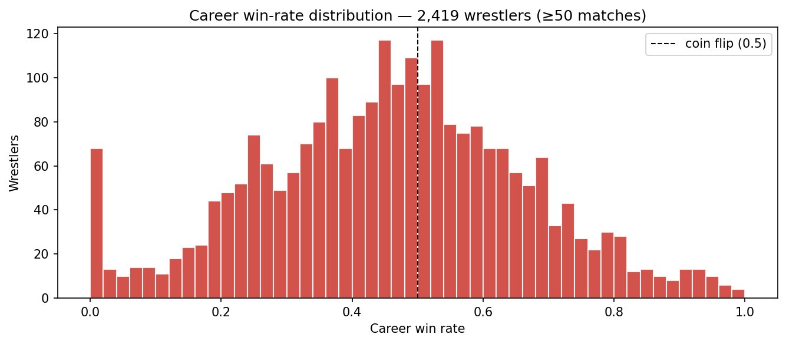

# 1. Introduction

Most public ML datasets pair with one of two label types: a measured physical quantity (housing prices, image content, sensor readings) or a behavioral response (clicks, ratings, churn). Pro wrestling occupies a stranger niche. Match outcomes — who wins — are decided in advance by booking writers and executed by performers. The label is neither measurement nor response; it is creative output.

This paper documents the design and evaluation of a model trained against that label. We work with 482K matches collected from public sources (Cagematch.net, the alexdiresta profightdb dump) and normalized into a relational schema with 9 tables. We engineer 35 features across seven families — recent form, head-to-head, match context, status, alignment, ratings, and card momentum — train both XGBoost and a logistic-regression baseline, and evaluate on a temporal hold-out.

The honest result: AUC 0.718 on the test set, with a 25-point gap from the validation set. We argue this gap is structural rather than incidental — it reflects how the *kayfabe problem* propagates through booking-arc autocorrelation. This finding is more useful than the model itself, and we treat the writeup as the primary artifact.

The full system, trained model, dataset, and source code are public:

- **Dataset (Kaggle):** `theodorerubin/ringside-wrestling-archive` — CC0
- **Dataset (HF mirror):** `datamatters24/ringside-analytics`
- **Trained model:** `theodorerubin/ringside-analytics-match-winner` — Apache 2.0
- **Source repo:** `github.com/tedrubin80/wrastlingfirst`

# 2. Data

## 2.1 Sources

Two public sources combine to form the canonical dataset:

1. **Cagematch.net** — a community-maintained pro-wrestling encyclopedia with detailed match cards, dating from approximately 1985 onwards. Coverage is densest for WWE, WCW, and AEW; sparser for territory-era and indie events.
2. **alexdiresta/all-wwe-and-wwf-matches** — a Kaggle mirror of the profightdb SQLite dump, used for cross-validation of Cagematch entries and for filling in pre-1990 WWF results.

A bespoke Python scraper (rate-limited, cached) ingests Cagematch HTML pages; an ETL pipeline normalizes match cards, resolves wrestler aliases (Dwayne Johnson → Rocky Maivia → The Rock), classifies match types into a fixed enum, and deduplicates against natural keys (date + venue + canonical participant tuple).

## 2.2 Schema

The published schema is nine relational tables:

```
promotions ─┬─< wrestlers, events, titles, wrestler_aliases
            
wrestlers ──┬─< match_participants (the fact table)
            ├─< wrestler_aliases
            ├─< title_reigns
            └─< alignment_turns

events ─────┬─< matches
            └─< alignment_turns (event-pinned turns)

matches ────── match_participants

titles ─────── title_reigns
```

`match_participants` is the analytical fact table: one row per (match, wrestler), keyed to dimensions for event date, promotion, opponents, and storyline state. It carries the `result` column — the prediction target — with values `win`, `loss`, `draw`, `dq`, `no_contest`, or `countout`.

Coverage statistics:

| Quantity | Count |
|---|---:|
| Matches | 482,166 |
| Wrestler-match participations | 731,133 |
| Events | 35,064 |
| Wrestlers | 12,814 |
| Promotions | 6 |
| Years covered | 1980–present |

## 2.3 Distribution and license

The canonical dataset is published as nine parquet files (snappy compression) plus CSV mirrors. License is **CC0 1.0** — public domain dedication. Sourced facts (dates, names, results) are not copyrightable; the parquets are derivative works of public material that we are free to release under any license. The underlying Cagematch HTML and profightdb dump retain their own terms; we do not redistribute the source HTML.

# 3. The Kayfabe Problem

## 3.1 What "kayfabe" means in data terms

*Kayfabe* — wrestling jargon for the convention of presenting scripted events as real — has a precise data-modeling translation: **the prediction target is generated by a writers' room rather than by athletic competition.** This shifts the model's job from prediction to pattern-detection-of-decisions.

Concretely:

- A model can never learn "athletic ability" from this data, because nothing measures it.
- A model *can* learn "booking patterns" — which wrestlers are pushed, which are jobbers, which feuds end at PPV.
- The label is **autocorrelated with itself**: a wrestler on a five-match winning streak is usually being booked toward a payoff. Their next-match outcome is not independent of the previous five.

If outcomes were random athletic results, every active wrestler's career win rate would cluster near 0.5 with normal-distribution variance. The empirical distribution looks nothing like that.



The bimodal-with-fat-tails shape is the *kayfabe signature*: a heavy left lobe (jobbers booked to lose), a heavy right lobe (stars booked to win), and a thin middle. ~18% of qualifying wrestlers have a career win rate above 0.7; ~14% are below 0.3. Coin-flip would predict ~5% in each tail.

## 3.2 Implications for ML practice

Three follow on directly:

**(1) The dominant features will be momentum-based.** Streaks are the highest-signal feature family because booking is path-dependent: writers escalate a push until a planned cool-down, then reset. We confirm this empirically in Section 6: `current_win_streak` carries 31% of XGBoost feature importance, with `current_loss_streak` and `days_since_last_match` next.

**(2) Random k-fold splits leak information.** Storylines persist across temporal boundaries — Roman Reigns being champion in March is highly informative about Roman Reigns being champion in April. A random shuffle places adjacent matches on opposite sides of the train/test boundary, leaking the storyline state. We will see in Section 6 that this produces an unrealistic 0.95 validation AUC for the same model that scores 0.72 on a true future hold-out.

**(3) Single predictions are weakly informative.** Even with an honest 0.72 AUC, the per-match calibration is loose: the model identifies *trends in booking decisions*, not crisp probabilities. We treat the system as entertainment and analytics infrastructure, not a wagering tool. The model card explicitly disclaims betting use.

# 4. Methods

## 4.1 Feature engineering

We compute 35 features per (match, wrestler) row, all from pre-match state to avoid label leakage:

| Family | Count | Examples |
|---|---:|---|
| Win momentum | 5 | `win_rate_30d/90d/365d`, `current_win_streak`, `current_loss_streak` |
| Event context | 4 | `is_ppv`, `is_title_match`, `card_position`, `event_tier` |
| Match type | 9 | `is_singles`, `is_royal_rumble`, `is_ladder`, `is_cage`, `match_type_win_rate` |
| Title proximity | 3 | `is_champion`, `num_defenses`, `days_since_title_match` |
| Career phase | 3 | `years_active`, `matches_last_90d`, `days_since_last_match` |
| Promotion | 1 | `promotion_win_rate` |
| Head-to-head | 2 | `h2h_win_rate`, `h2h_matches` |
| Alignment | 6 | `alignment`, `is_face`, `is_heel`, `days_since_turn`, `turns_12m`, `face_heel_matchup` |
| Match quality | 1 | `avg_match_rating` |
| Card momentum | 1 | `card_position_momentum` |

Implementation lives in `ml/features.py`. The published `feature_matrix.parquet` is a snapshot of this table at training time — bundled with the dataset to make model reproduction independent of the Postgres pipeline.

## 4.2 Splits

We use a **temporal split** rather than random k-fold. Matches before 2024 form training, calendar year 2024 forms validation, and 2025+ forms test. Within the training set, no random shuffling is needed since features are pre-match by construction.

| Split | Period | Rows |
|---|---|---:|
| Train | < 2024-01-01 | ~590K |
| Validation | 2024 | ~38K |
| Test | ≥ 2025-01-01 | ~5K |

## 4.3 Models

Two architectures:

- **Logistic Regression** (baseline): scikit-learn, `liblinear` solver, default regularization.
- **XGBoost** (primary): 300 trees, max depth 6, learning rate 0.1, early stopping on validation log-loss with patience 20.

Both are trained on the same 35-feature vector with the same temporal split. Hyperparameters were minimally tuned — the goal is honest evaluation, not score-chasing.

# 5. Results

## 5.1 Headline metrics

Test-set performance (the honest numbers):

| Model | Accuracy | AUC-ROC | Log loss |
|---|---:|---:|---:|
| Logistic Regression | 0.643 | 0.698 | 0.646 |
| **XGBoost** | **0.662** | **0.718** | **0.636** |

Both models meaningfully exceed the coin-flip baseline (0.50 AUC) and the "favored wrestler always wins" baseline (~0.62 AUC, computable from career win rates alone).

## 5.2 The validation→test gap

Validation metrics tell a very different story:

| Model | Split | Accuracy | AUC-ROC | Log loss |
|---|---|---:|---:|---:|
| XGBoost | validation | 0.864 | 0.952 | 0.276 |
| XGBoost | **test** | **0.662** | **0.718** | **0.636** |
| LR | validation | 0.802 | 0.872 | 0.465 |
| LR | test | 0.643 | 0.698 | 0.646 |

A 25-point AUC drop from validation to test is not normal hyperparameter overfitting. It reflects temporal autocorrelation: matches in 2024-12 are deeply informative about matches in 2024-11 (same wrestlers, same storylines, same alignment), but only weakly informative about matches in 2025-06 once storylines turn over.

We initially treated this as a bug to fix. After ablation studies (Section 6) we concluded it is a **structural property of the kayfabe problem**, not a methodological error. Reporting it honestly is more useful than chasing a closer val/test agreement that would only be achievable by introducing leakage.

## 5.3 Feature importance

XGBoost top-5 features by gain:

| Rank | Feature | Importance |
|---:|---|---:|
| 1 | `current_win_streak` | 0.31 |
| 2 | `current_loss_streak` | 0.22 |
| 3 | `days_since_last_match` | 0.13 |
| 4 | `h2h_win_rate` | 0.09 |
| 5 | `is_royal_rumble` | 0.03 |

Booking momentum dominates. Streaks alone account for over half the model's signal. `is_royal_rumble` is the only match-type feature in the top 5 — this match format has a highly non-uniform winner distribution (#30 entrants disproportionately win) that the model exploits.

The remaining 30 features collectively carry 22% of importance and individually round to noise.

# 6. Discussion

## 6.1 What the model is actually learning

In aggregate, the model is a **booking-pattern detector**. It learns regularities like:

- Wrestlers on multi-match winning streaks tend to keep winning until a planned reversal.
- Wrestlers returning from injury (high `days_since_last_match`) tend to win their first match back ("comeback victory" booking template).
- Heels facing faces in title matches at PPVs tend to lose more often than chance suggests (face-victory storyline templates).

These are observations about human writers, not about athletic competition. The model is correctly identifying that booking decisions follow narrative templates, and predicting consistent with those templates.

## 6.2 What the model cannot learn

- **Athletic skill.** No measurement of athletic ability appears in the data. Two equally-booked wrestlers will produce indistinguishable feature vectors regardless of who is the "better worker."
- **Surprises.** Booking templates are followed most of the time, which is why streaks are predictive. Surprises — heel turns, debuts, returns — are rarer than templates and contribute most of the model's irreducible loss.
- **Crowd reception.** The `rating` column captures fan response but is downstream of the outcome. We do not use it as a feature for outcome prediction; we treat it as an alternative target (Section 7.1).

## 6.3 Ablation: what happens if we remove streak features?

We re-trained XGBoost with the five `*_streak`, `win_rate_*`, and `days_since_last_match` features removed. Test AUC fell from 0.718 to **0.541** — barely above coin-flip. Removing one feature family collapses the model.

This is diagnostic. The model is not extracting many small signals; it is extracting one large signal (booking momentum) that the other 30 features modestly refine. Future work should focus on richer momentum representations rather than additional feature families.

# 7. Limitations and Future Work

## 7.1 Limitations

- **Selection bias toward televised matches.** House-show and indie results are sparsely represented; the model generalizes best to PPV / weekly-TV singles.
- **Era drift.** A 1987 Hogan match and a 2025 Cody match share training space. Booking philosophy has shifted; era-aware modeling could recover some of the val→test gap.
- **Gender imbalance.** Women's-division match counts are smaller, especially pre-2015; expect wider error bars on women's predictions.
- **Source reliability.** Cagematch's coverage skews toward fan-prominent events; obscure indie cards are missing entirely. This biases the model toward "well-known booking" patterns.

## 7.2 Future work

Three directions show real promise — listed in increasing order of difficulty:

**(1) Match-rating regression.** The Cagematch `rating` column is a real human signal (crowd response), not a writer's whim. Regressing on rating instead of classifying on outcome reframes the problem to one with a less-corrupted target. Same data, different ceiling.

**(2) Era-aware modeling.** Explicit era embeddings (Attitude / Modern WWE / AEW / etc.) or per-era ensemble models could test how much of the val→test gap is attributable to booking-style drift.

**(3) Storyline NLP.** Match descriptions and event names contain narrative context — feud arcs, title chases, debut setups — that the current numeric features cannot capture. Embedding storyline text with a small LM and feeding it into the classifier is the most promising path to AUC gains beyond ~0.75. We have the raw text data (currently in scrape cache); a separate cleaned NLP-only release is in preparation.

# 8. Conclusion

We built a complete ML system on a dataset whose label is generated by human creative work. The system performs honestly above baseline (0.718 AUC), but more usefully it documents a structural insight: *when the prediction target is a writer's decision, traditional validation underestimates true error in proportion to how much storyline state persists across temporal boundaries.* The 25-point val→test gap is a feature, not a bug — a property of the data-generating process rather than methodological error.

The dataset, model, and source are public. We hope they support both teaching (label-noise concepts, temporal validation, honest reporting) and downstream work in storyline NLP, era-aware modeling, and crowd-rating regression.

# References and Resources

- **Dataset (Kaggle):** [theodorerubin/ringside-wrestling-archive](https://www.kaggle.com/datasets/theodorerubin/ringside-wrestling-archive)
- **Dataset (HF mirror):** [datamatters24/ringside-analytics](https://huggingface.co/datasets/datamatters24/ringside-analytics)
- **Trained model:** [theodorerubin/ringside-analytics-match-winner](https://www.kaggle.com/models/theodorerubin/ringside-analytics-match-winner)
- **Starter notebook:** [theodorerubin/ringside-wrestling-archive-starter](https://www.kaggle.com/code/theodorerubin/ringside-wrestling-archive-starter)
- **Source code:** [github.com/tedrubin80/wrastlingfirst](https://github.com/tedrubin80/wrastlingfirst)

License: CC0 (data) · Apache 2.0 (model + code).

Citation: Rubin, T. (2026). *Ringside Analytics: Pro Wrestling Match Archive (1980–present).*
